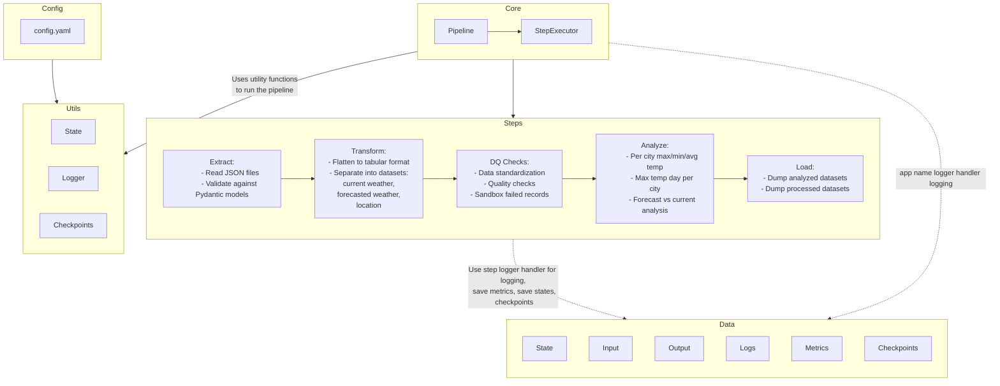

# Weather ETL Pipeline Documentation

## 1. Introduction

This Weather ETL (Extract, Transform, Load) pipeline is designed to process weather data efficiently and reliably. It features a modular architecture with distinct components for each stage of the ETL process, extensive logging, data quality checks, and a robust checkpoint system for restartability.

## 2. High-Level Component Overview

- **Extract**: Reads weather data from JSON source files.
- **Transform**: Processes and cleanses the extracted weather data.
- **Data Quality Checks**: Validates the transformed data against predefined quality rules.
- **Analyze**: Performs temperature analysis on the processed data.
- **Load**: Writes the final processed data to CSV files.
- **Core**: Manages the overall pipeline execution and step sequencing.
- **Utils**: Provides utility functions for logging, state management, and checkpointing.



## 3. Deep Dive into Components

### 3.1 Extract (`src/steps/extract/`)

#### weather_data_reader.py
This script is responsible for reading the raw weather data from the JSON source file.

Key functions:
- `read_weather_data(input_file: str) -> Dict`: Reads and parses the JSON file.
- `validate_input_data(data: Dict) -> bool`: Performs initial validation on the input data.

#### weather_datamodel.py
Defines the data models for weather information, ensuring consistent data structures throughout the pipeline.

Classes:
- `WeatherObservation`: Represents current weather data.
- `WeatherForecast`: Represents forecast weather data.
- `Location`: Represents location information.

### 3.2 Transform (`src/steps/transform/`)

#### weather_data_processing.py
Handles the main data transformation logic.

Key functions:
- `process_current_weather(data: Dict) -> pd.DataFrame`: Transforms current weather data.
- `process_forecast_weather(data: Dict) -> pd.DataFrame`: Transforms forecast weather data.
- `normalize_temperature(temp: float, unit: str) -> float`: Converts temperatures to a standard unit.

### 3.3 Data Quality Checks (`src/steps/dq_checks/`)

#### weather_data_quality_checks.py
Implements data validation rules to ensure data quality.

Key functions:
- `check_completeness(df: pd.DataFrame) -> bool`: Verifies all required fields are present.
- `check_value_ranges(df: pd.DataFrame) -> bool`: Validates that values fall within expected ranges.
- `check_data_consistency(df: pd.DataFrame) -> bool`: Ensures data consistency across related fields.

### 3.4 Analyze (`src/steps/analyze/`)

#### weather_temperature_analysis.py
Performs analysis on the processed temperature data.

Key functions:
- `calculate_temperature_statistics(df: pd.DataFrame) -> Dict`: Computes various temperature statistics.
- `identify_temperature_trends(df: pd.DataFrame) -> Dict`: Analyzes temperature trends over time.

### 3.5 Load (`src/steps/load/`)

#### weather_csv_writer.py
Handles writing the processed data to CSV files.

Key functions:
- `write_to_csv(df: pd.DataFrame, output_file: str) -> None`: Writes a DataFrame to a CSV file.
- `create_output_directory(directory: str) -> None`: Ensures the output directory exists.

### 3.6 Core (`src/core/`)

#### pipeline.py
Manages the overall execution of the ETL pipeline.

Key classes:
- `Pipeline`: Orchestrates the execution of all ETL steps.

#### step_executor.py
Handles the execution of individual pipeline steps.

Key classes:
- `StepExecutor`: Executes a single step of the pipeline with error handling and logging.

### 3.7 Utils (`src/utils/`)

#### etl_logger.py
Implements the extensive logging system.

Key functions:
- `setup_logging(log_file: str, level: str) -> logging.Logger`: Configures the logging system.
- `log_step_start(logger: logging.Logger, step_name: str) -> None`: Logs the start of a pipeline step.
- `log_step_end(logger: logging.Logger, step_name: str) -> None`: Logs the end of a pipeline step.

#### state.py
Manages the pipeline state for restartability.

Key classes:
- `PipelineState`: Tracks the current state of the pipeline execution.

#### checkpoints.py
Implements the checkpoint system for restartability.

Key functions:
- `save_checkpoint(state: PipelineState, checkpoint_dir: str) -> None`: Saves the current pipeline state.
- `load_checkpoint(checkpoint_dir: str) -> PipelineState`: Loads the last saved pipeline state.

## 4. Checkpoint System and Restartability

The pipeline uses a checkpoint system to enable restartability. After each major step, the pipeline state is saved to a checkpoint file. If the pipeline fails, it can be restarted from the last successful checkpoint.

Key aspects:
- Checkpoints are saved in the `data/checkpoints/` directory.
- Each checkpoint contains the current pipeline state, including completed steps and intermediate data references.
- The `PipelineState` class in `state.py` manages the serialization and deserialization of the pipeline state.

## 5. Run ID and Session Management

Each pipeline execution is assigned a unique Run ID (a UUID). This Run ID is used to:
- Create a unique directory for output files (`data/output/<run_id>/`)
- Generate unique log files for each run (`data/logs/<run_id>/`)
- Associate metrics and checkpoints with specific runs

The Run ID ensures that multiple pipeline executions don't interfere with each other and allows for easy tracking and debugging of individual runs.

## 6. Data Quality Checks

Data quality checks are implemented in the `dq_checks` step and include:
- Completeness checks: Ensuring all required fields are present
- Range checks: Validating that numeric values fall within expected ranges
- Format checks: Verifying date formats, string lengths, etc.
- Consistency checks: Ensuring related data points are consistent (e.g., max temperature >= min temperature)

Failed data quality checks generate detailed log entries and can optionally halt the pipeline execution.

## 7. Extensive Logging

The pipeline implements comprehensive logging throughout its execution:
- Each step has its own log file (`data/logs/<run_id>/<step_name>/`)
- A main pipeline log captures overall execution progress (`data/logs/<run_id>/weather_etl.log`)
- Log levels (INFO, WARNING, ERROR) are used to categorize log messages
- Detailed error messages and stack traces are logged for debugging
- Performance metrics (execution time, data volumes) are logged for each step

The logging system provides a complete audit trail of the pipeline execution and is crucial for monitoring, debugging, and performance optimization.

## 8. Execution

To run the pipeline:

```bash
python weather_etl.py [--config CONFIG_FILE] [--debug] [--restart]