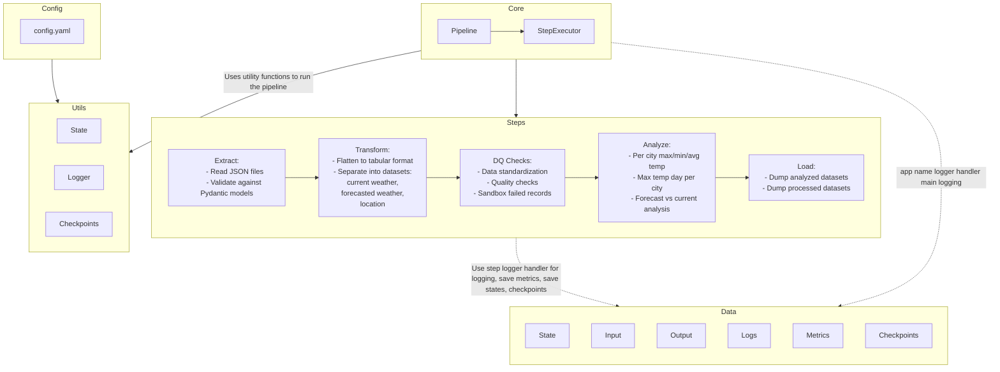

# Weather ETL Pipeline Documentation

## 1. Introduction

This Weather ETL (Extract, Transform, Load) pipeline is designed to process weather data efficiently and reliably. It features a modular architecture with distinct components for each stage of the ETL process, extensive logging, data quality checks, and a robust checkpoint system for restartability.

## 2. High-Level Component Overview

- **Extract**: Reads weather data from JSON source files.
- **Transform**: Processes and cleanses the extracted weather data.
- **Data Quality Checks**: Validates the transformed data against predefined quality rules.
- **Analyze**: Performs temperature analysis on the processed data.
- **Load**: Writes the final processed data to CSV files.
- **Core**: Manages the overall pipeline execution and step sequencing.
- **Utils**: Provides utility functions for logging, state management, and checkpointing.

## 3. Pipeline Flow

## 3. Deep Dive into Components

### 3.1 Extract (`src/steps/extract/`)

#### weather_data_reader.py
This script is responsible for reading the raw weather data from the JSON source file.

Key functions:
    - `execute_extract(data: Dict, config_dict: Dict, logger: logging.Logger) ->Dict`: function serves as the entry point for the extraction process
    - `_read_json_file(input_file: str) -> Dict`: Reads and parses the JSON file and validation on the prased data.

#### weather_datamodel.py
Defines the Pydantic data models for weather information, ensuring consistent data structures throughout the pipeline.

Key Classes:
- `CurrentWeather`: Represents current weather data.
- `ForecastDay`: Represents forecast weather data.
- `Location`: Represents location information.

### 3.2 Transform (`src/steps/transform/`)

#### weather_data_processing.py
Handles the main data transformation logic.

Key functions:
`_combine_weather_data(key:int,data: Dict[str, Any]) -> Tuple[pd.DataFrame]`: Combines location and current weather data with forecast data.
    
`_get_parsed_weather_dataframes(data: Dict[str, Any]) -> Tuple[pd.DataFrame]`: Processes multiple weather data inputs concurrently.

`execute_transform(data: Dict, config_dict: Dict, logger: logging.Logger) -> Dict:`: function serves as the main entry point for the transformation pipeline

### 3.3 Data Quality Checks (`src/steps/dq_checks/`)

#### weather_data_quality_checks.py
Implements data validation rules to ensure data quality and quarantie the data quality failed records

Key functions:
`_fill_missing_values(df: pd.DataFrame) -> pd.DataFrame`:
        Fill integer columns with 0.
        Fill float columns with 0.0.
        Fill string/object columns with an empty string

`_validate_location_data(df: pd.DataFrame) -> Tuple[pd.DataFrame, pd.DataFrame]`: Perform Data quality checks on location data

`_validate_forecast_weather_data(df: pd.DataFrame) -> Tuple[pd.DataFrame, pd.DataFrame]`: Perform Data quality checks on forecasted weather data

`_validate_current_weather_data(df: pd.DataFrame) -> Tuple[pd.DataFrame, pd.DataFrame]`: Perform Data quality checks on current weather data

`_profile_weather_data(current_df: pd.DataFrame, forecast_df: pd.DataFrame, location_df: pd.DataFrame) -> List[List[pd.DataFrame]]`:    Processes multiple weather-related DataFrames by filling missing values and standardizing formats.

`execute_dq_checks(data: Dict[str, pd.DataFrame], config_dict: Dict, logger: logging.Logger) -> Dict[str,pd.DataFrame]`: function serves as the main entry point for the weather data quality checks.

### 3.4 Analyze (`src/steps/analyze/`)

#### weather_temperature_analysis.py
Performs analysis on the processed temperature data.

Key functions:
`_calculate_forecasted_to_current_temp_diff(df: pd.DataFrame) -> pd.DataFrame`: Computes the difference between forecasted 
    and current temperatures in both Celsius and Fahrenheit.

`_get_max_temperature_per_city(df: pd.DataFrame) -> pd.DataFrame`: Aggregates maximum, mean, and minimum temperatures per city.

`_get_day_of_max_temperature(df: pd.DataFrame) -> pd.DataFrame`: Determines the day with the highest recorded maximum temperature 
    for each city.

`execute_analyze(data: Dict[str, pd.DataFrame], config_dict: Dict, logger: logging.Logger) -> Dict[str,pd.DataFrame]`: function serves as the main entry point for the weather data Analysis.

### 3.5 Load (`src/steps/load/`)

#### weather_csv_writer.py
Handles writing the processed data to CSV files.

Key functions:
`save_dataframe_to_csv(dataframe: pd.DataFrame, file_path: Path) -> None`: Writes a DataFrame to a CSV file.

`_export_weather_data_to_csv(directory_path: str, max_temp_data: pd.DataFrame, aggregated_data: pd.DataFrame,forecasted_vs_current_data: pd.DataFrame,current_df: pd.DataFrame, forcast_df: pd.DataFrame,location_df: pd.DataFrame) -> None`:     Write weather data DataFrames to CSV files in the specified directory.

`execute_load(data: Dict[str, pd.DataFrame], config_dict: Dict, logger: logging.Logger) -> None`: function serves as the main entry point for the weather data load phase.

### 3.6 Core (`src/core/`)

#### pipeline.py
This module implements a pipeline execution function that runs individual data processing steps 
for weather data analysis. The pipeline handles extraction, transformation, profiling, analysis 
and loading of weather data while providing state management, checkpoints and logging.

Key Features:
    - State management for each pipeline step
    - Checkpoint-based execution tracking
    - Detailed logging of pipeline execution
    - Error handling with diagnostics
    - Configurable step execution
    - Data validation and quality checks

Key functions:
`_setup_pipeline_directories(config: Dict, root_dir: Path,run_id:str) -> tuple[Path, Path, Path,Path]`: Helper function to create pipeline directories

`execute_pipeline(config_path: Path = 'config/config.yaml') -> Dict[str, Any]`:   Execute data processing pipeline with checkpoint-based resumability.

#### step_executor.py

This module implements a pipeline execution function that runs individual data processing steps 
for weather data analysis. It handles extraction, transformation, dq_checks, analysis and loading
of weather data while providing state management, checkpoints and logging.

Key Functions:

`execute_step(step: str, data: Dict[str, Any], state_dir: Path,checkpoint_dir: Path, config_dict: Dict,logger: logging.Logger) -> Dict[str, Any]`: Executes a single pipeline step with state management and checkpointing

Key features:
    - Executes pipeline steps based on function mapping
    - Saves state after each step
    - Creates checkpoints for resume capability
    - Comprehensive logging
    - Error handling and reporting

### 3.7 Utils (`src/utils/`)

#### etl_logger.py

This module provides centralized logging configuration for the weather ETL pipeline.
It handles log file setup, formatting, and execution time tracking.

Key Functions:
`_load_config(config_path: Path) -> Dict[str,Dict]`: Helper function to load YAML configuration file

`get_logger(config_path: Path,runid:str) -> logging.Logger:`: Configures and returns logger instance
        - Loads YAML configuration
        - Sets up log directories and files
        - Configures handlers and formatters
        - Provides fallback logging on failure

#### state.py
This module handles state management for the ETL pipeline, including:
    - Saving and loading step data
    - Managing metadata and execution history
    - Tracking pipeline state transitions
    - Directory cleanup and maintenance
    - set the pipeline envrionment variables

Key Functions:
`save_step_data(data: Dict, step: str, state_dir: Path) -> None`: Persists step output data

`load_step_data(step: str, state_dir: Path, logger: logging.Logger) -> Dict[str,pd.DataFrame]`: Retrieves step data from storage
`log_metadata(step: str,status: str,start_time: datetime,duration: int,end_time: Optional[datetime] = None,input_files: Optional[list] = None,output_files: Optional[list] = None,error: Optional[str] = None,additional_info: Optional[Dict] = None) -> Dict[str,Any]`: Creates execution metadata records

`save_step_metadata(step: str, metadata: dict, metric_dir: Path) -> None`: Stores step metadata history

`get_previous_state(state: str,pipeline_states:List[str]) -> str`: Determines previous pipeline state

`clean_directory(directorys: List[Path], logger: logging.Logger, keep_dir=True) -> None`: Removes temporary files and directories

`get_run_id(state_dir: Path) -> str`: Generate or retrieve a run ID for the pipeline execution

`set_env(env: str, run_id: str, app_name: str, metrics_dir: str) -> None`:Set essential environment variables for the pipeline run

#### checkpoints.py
This module provides functionality for managing pipeline execution state through 
checkpoints and state directories. It handles checkpoint creation, verification,
and determines which pipeline steps need to be executed based on current state.

Functions:
`setup_directories(root_dir: Path,steps:List[str]) -> Tuple[Path, Path]`: Creates checkpoint and state directories

`create_checkpoint(checkpoint_dir: Path, step: str) -> bool`: Creates checkpoint file for completed step

`check_checkpoint(checkpoint_dir: Path, step: str) -> bool`: Verifies if checkpoint exists for step

`check_pipeline_state(state_dir: Path,checkpoint_dir: Path,pipeline_steps: List[str]) -> Tuple[bool, Optional[str]]`: Check pipeline state and determine if it needs to run from beginning.

`get_required_steps(pipeline_steps: List[str],state_dir: Path,checkpoint_dir: Path,logger:logging.Logger,failed_step: Optiona[str]= None,target_step: Optional[str]= None) -> List[str]`: Determine which steps need to be executed based on pipeline state

## 3.8. Configurations(`config/config.yaml`)
The `config.yaml` file allows for flexible customization and includes the following sections:

### Default Settings
- `app_name`: The name of the application (e.g., `"weather_etl"`).
- `environment`: Application environment (e.g., `"dev"`).
- `log_level`: Sets the default log level (`"INFO"`).
- `timezone`: Sets the timezone (e.g., `"UTC"`).

### Paths
- `root`: Root directory for the project.
- `input`: 
- `dir`: Directory where input data is located.
- `weather_file`: Input weather file name.
- `output`: Directory for output files.
- `logs`: Directory for logs.
- `checkpoint`: Directory for pipeline checkpoints.
- `state`: Directory for saving the state information.
- `metrics`: Directory for saving metrics data.

### Logging Configuration
- `version`: Logging configuration version.
- `disable_existing_loggers`: Disables existing loggers if set to `True`.
- `formatters`: 
  - `standard`: Basic logging format.
  - `detailed`: Detailed logging format including module and function details.
- `handlers`: Defines handlers for various pipeline stages (e.g., `extract_handler`, `transform_handler`) with options like file rotation.
- `loggers`: Specifies loggers for each stage of the pipeline (e.g., `weather_etl.extract`).

### Steps
- `execution_order`: Defines the order in which pipeline steps are executed.
- `dependencies`: Sets dependencies between steps, ensuring each step completes before dependent steps start.
- `save_metadata`: A flag to indicate if metadata should be saved after each step.

## 4. Checkpoint System and Restartability

The pipeline uses a checkpoint system to enable restartability. After each major step, the pipeline state is saved to a checkpoint file. If the pipeline fails, it can be restarted from the last successful checkpoint.

Key aspects:
- Checkpoints are saved in the `data/checkpoints/` directory.
- Each checkpoint contains the current pipeline state, including completed steps and intermediate data references.
- The `state.py` manages the serialization and deserialization of the pipeline state.

## 5. Run ID and Session Management

Each pipeline execution is assigned a unique Run ID (a UUID). This Run ID is used to:
- Create a unique directory for output files (`data/output/<run_id>/`)
- Generate unique log files for each run (`data/logs/<run_id>/`)
- Associate metrics and checkpoints with specific runs

The Run ID ensures that multiple pipeline executions don't interfere with each other and allows for easy tracking and debugging of individual runs.

## 6. Data Quality Checks

Data quality checks are implemented in the `dq_checks` step and include:
- Completeness checks: Ensuring all required fields are present
- Range checks: Validating that numeric values fall within expected ranges
- Format checks: Verifying date formats, string lengths, etc.
- Consistency checks: Ensuring related data points are consistent (e.g., max temperature >= min temperature)

Failed data quality checks generate detailed log entries and quarantie the records.

## 7. Extensive Logging

The pipeline implements comprehensive logging throughout its execution:
- Each step has its own log file (`data/logs/<run_id>/<step_name>/`)
- A main pipeline log captures overall execution progress (`data/logs/<run_id>/weather_etl.log`)
- Log levels (INFO, DEBUG, ERROR) are used to categorize log messages
- Detailed error messages and stack traces are logged for debugging
- Performance metrics (execution time, data volumes) are logged for each step

The logging system provides a complete audit trail of the pipeline execution and is crucial for monitoring, debugging, and performance optimization.
